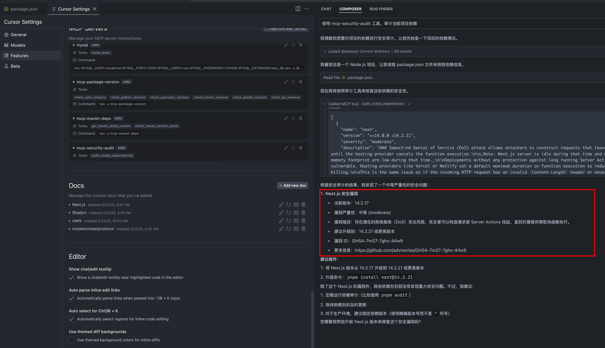
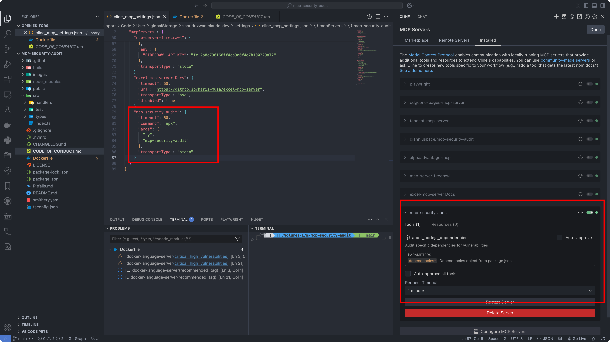

我已阅读完整个项目代码库。这是一个基于 MCP (Model Context Protocol) 的 npm 包安全审计工具。让我帮您优化 README.md，使其更加清晰和专业。

```markdown
# Security Audit Tool

[](https://smithery.ai/server/@qianniuspace/mcp-security-audit)
[](https://www.npmjs.com/package/mcp-security-audit)
[](https://opensource.org/licenses/MIT)

A powerful MCP (Model Context Protocol) Server that audits npm package dependencies for security vulnerabilities. Built with remote npm registry integration for real-time security checks.

## Features

- 🔍 Real-time security vulnerability scanning
- 🚀 Remote npm registry integration
- 📊 Detailed vulnerability reports with severity levels
- 🛡️ Support for multiple severity levels (critical, high, moderate, low)
- 📦 Compatible with npm/pnpm/yarn package managers
- 🔄 Automatic fix recommendations
- 📋 CVSS scoring and CVE references


## MCP Integration

1. Clone the repository:
```bash
git clone https://github.com/qianniuspace/mcp-security-audit.git
cd mcp-security-audit
```

2. Install dependencies and build:
```bash
npm install
npm run build
```

3. Add MCP configuration to Cursor:
```json
{
  "Name": "mcp-security-audit",
  "Type": "command",
  "Command": "node /path/to/mcp-security-audit/build/index.js"
}
```

4. Add MCP configuration to Cline:
```json
{
  "mcpServers": {
    "mcp-security-audit": {
      "command": "npx",
      "args": ["-y", "/path/to/mcp-security-audit/build/index.js"]
    }
  }
}
```

## Configuration Screenshots

### Cursor Configuration


### Cline Configuration



## API Response Format

The tool provides detailed vulnerability information including severity levels, fix recommendations, CVSS scores, and CVE references.

### Response Examples

#### 1. When Vulnerabilities Found (Severity-response.json)
```json
{
  "content": [{
    "vulnerability": {
      "packageName": "lodash",
      "version": "4.17.15",
      "severity": "high",
      "description": "Prototype Pollution in lodash",
      "cve": "CVE-2020-8203",
      "githubAdvisoryId": "GHSA-p6mc-m468-83gw",
      "recommendation": "Upgrade to version 4.17.19 or later",
      "fixAvailable": true,
      "fixedVersion": "4.17.19",
      "cvss": {
        "score": 7.4,
        "vector": "CVSS:3.1/AV:N/AC:H/PR:N/UI:N/S:U/C:H/I:H/A:N"
      },
      "cwe": ["CWE-1321"],
      "url": "https://github.com/advisories/GHSA-p6mc-m468-83gw"
    },
    "metadata": {
      "timestamp": "2024-04-23T10:00:00.000Z",
      "packageManager": "npm"
    }
  }]
}
```

#### 2. When No Vulnerabilities Found (no-Severity-response.json)
```json
{
  "content": [{
    "vulnerability": null,
    "metadata": {
      "timestamp": "2024-04-23T10:00:00.000Z",
      "packageManager": "npm",
      "message": "No known vulnerabilities found"
    }
  }]
}
```


## Development

For development reference, check the example response files in the `public` directory:
- [Severity-response.json](public/Severity-response.json) : Example response when vulnerabilities are found (transformed from npm audit API response) 
- [no-Severity-response.json](public/no-Severity-response.json) : Example response when no vulnerabilities are found (transformed from npm audit API response)

Note: The example responses shown above are transformed from the raw npm audit API responses to provide a more structured format. The original npm audit API responses contain additional metadata and may have a different structure.

## Contributing

Contributions are welcome! Please read our [Contributing Guide](CODE_OF_CONDUCT.md) for details on our code of conduct and the process for submitting pull requests.

## License

This project is licensed under the MIT License - see the [LICENSE](LICENSE) file for details.

## Author

ESX (qianniuspace@gmail.com)

## Links

- [GitHub Repository](https://github.com/qianniuspace/mcp-security-audit)
- [Issue Tracker](https://github.com/qianniuspace/mcp-security-audit/issues)
- [Changelog](CHANGELOG.md)
```
